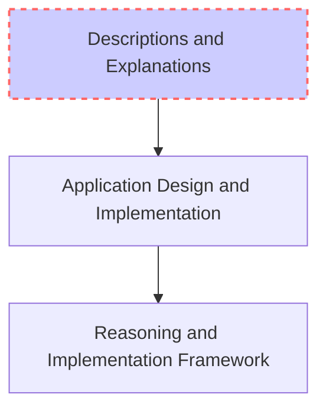
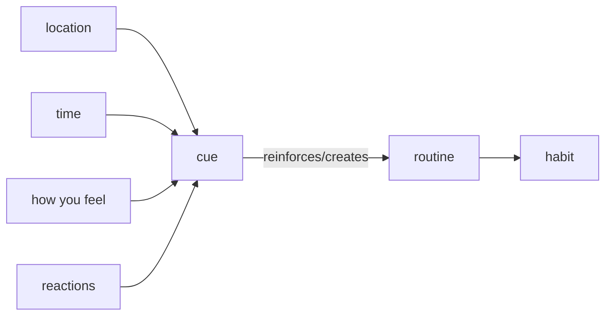

# learning and memory

Thoughts on Learning and Memory

Unstructured Learning (over large and small time intervals) vs Strategic Skill Making (in small time intervals)

## Spaced Repetition

Leveraging the Spacing Effect phenomenon as a technique in learning

- [ ] Get Literature Review and Techniques from [Gwern's Blog](https://www.gwern.net/Spaced-repetition)
- [ ] Possible Good Advice from [Mullen Memory](https://mullenmemory.com/memory-palace-study-hacks)
- [ ] Using [Anki](https://apps.ankiweb.net/docs/manual.html#introduction)

### Material from Michael Nielsen

- [ ] [Augmenting Long-Term Memory](http://augmentingcognition.com/ltm.html)
- [ ] [SR for Mathematics](http://cognitivemedium.com/srs-mathematics)
- [ ] [SR Twitter Thread](https://twitter.com/michael_nielsen/status/957763229454774272)

## Learning How to Learn

MOOC offered by Barbara Oakley and Terrence Sejnowski [Learning how to Learn](https://www.coursera.org/learn/learning-how-to-learn)

- Focused and Diffused Modes of Thinking
- Chunking & Library of Chunks : Conceptual Chunks related to each other through 'Meaning'
- (4)Sloted Working Memory vs WareHouse Long Term Memory
- Meta Cognition can change Cognition

**Behavioural**

- Sleep is really important to Learning - Long Term Memory formation
- Chunks relate to Networks of Neurons
- You can Learn by Doing, Active Engagement
- Physical (action) Nature of Learning : Exercise invokes Thinking Paths, Embodied Cognition involves Environment, Memory Palaces
- Temporal Nature of Learning : The Pomodoro Technique, Spaced Repetition, Chunking through Focused Practise and Repetition
(*Explanations are Lacking*)

**Habit Formation**

### Memory Palaces and other Ancient Techniques

[Embodied Cognition](https://en.wikipedia.org/wiki/Embodied_cognition) running on Ancient Memory Architectures

*Interesting*

- Cultural Memory as contained in Explanations in the work of [Lynne Kelly](http://www.lynnekelly.com.au)
- *Idea* Philosophy in Popular Music, Music as Knowledge Tools
- [The Extended Mind](http://consc.net/papers/extended.html) - Andy Clark and David Chalmers

### Grit and Growth MindSet

Research is probably unfounded garbage, Although Ideas might be nice.

Grit is Passion and Perserverance through long time.

- [ ] [BrainPickings](https://www.brainpickings.org/2014/01/29/carol-dweck-mindset/)
- [ ] [Farnam Street](https://fs.blog/2015/03/carol-dweck-mindset/)

Does it Replicate?

- [x] [MR - Growth MindSet Replicates!](https://marginalrevolution.com/marginalrevolution/2018/03/growth-mindset-replicates.html)

> Growth MindSet Interventions has positive but _very small_ effects measured on high school outcomes? (see https://psyarxiv.com/md2qa)

## Miscellaneous

- [Searching the Greatest Almanac](gwern.net/Search)
